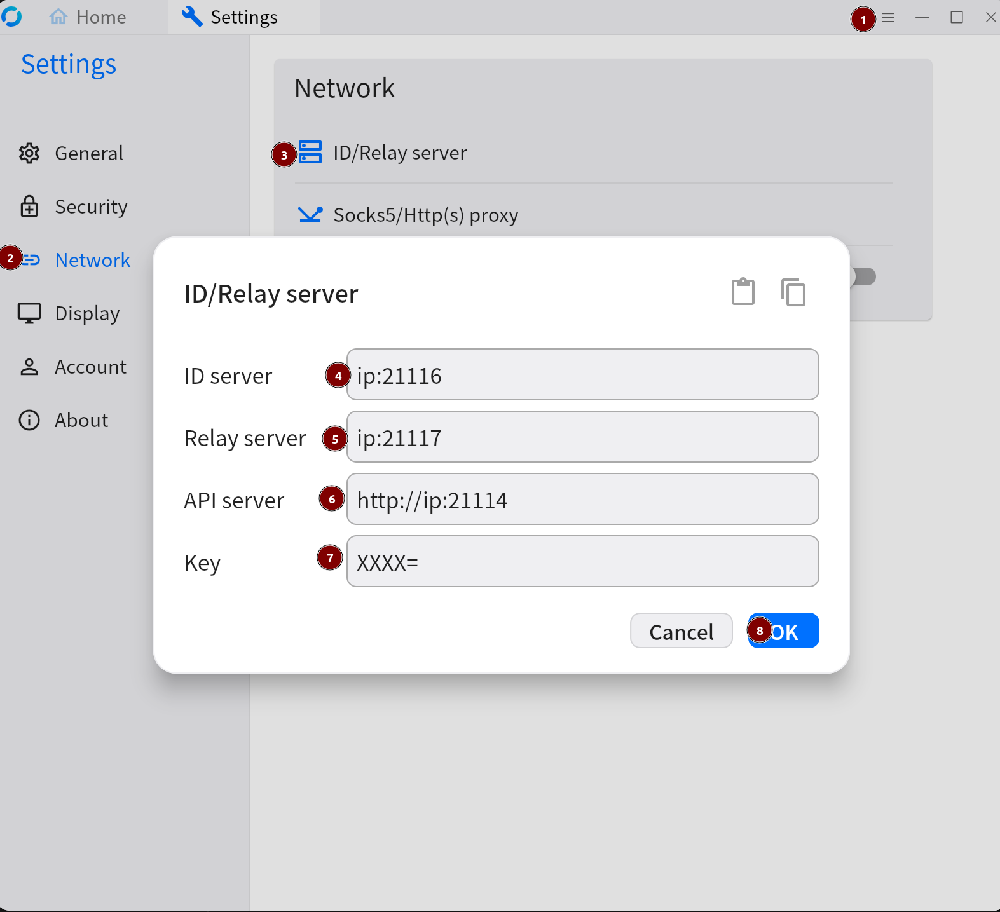
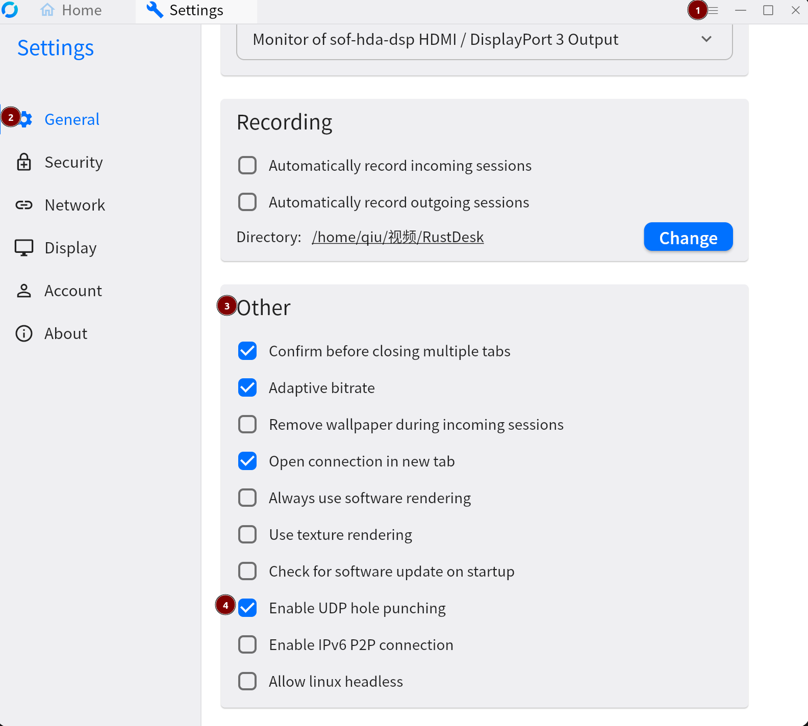
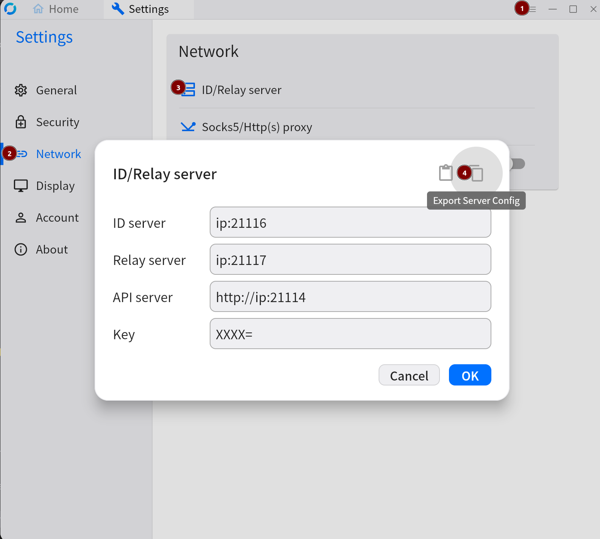
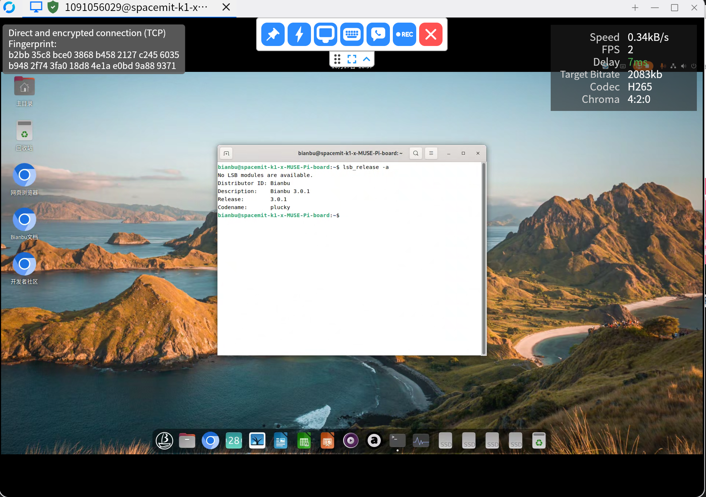

<p align="center">
  <br>
  <a href="#Build">Build</a> •
  <a href="#Installation">Installation</a> •
  <a href="#License">License</a> •
  <a href="#Screenshots">Screenshots</a> •
  <a href="#FAQ">FAQ</a> •
  <a href="#Known-Issues">Known Issues</a><br>
  <a href="README-ZH.md">中文</a> •
  <a href="README.md">English</a>
</p>

# SpacemiT K1 Support

This fork adds support for the **SpacemiT K1** RISC-V development board, which allows you to remote control the K1 device using RustDesk.

## Features

- **Remote Desktop**: Access the desktop of remote devices
- **Remote Terminal**: Access the terminal of remote devices
- **Clipboard Sync**: Share clipboard with the remote development board
- **Remote Audio**: Play sound from remote devices
- **Custom Server Configuration**: Configure RustDesk Server via command line
- **Video Hardware Acceleration**: Support H.264/H.265 hardware encoding
- **P2P Direct Connection**: Support UDP hole punching for lower latency

## Build

### Prerequisites

- Hardware: [SpacemiT K1](https://www.spacemit.com/key-stone-k1/)
- OS: [Bianbu Desktop 3.0 or later](https://bianbu.spacemit.com/)

### Install dependencies

```bash
sudo apt update
sudo apt install rustup sccache clang mold \ 
libvpx-dev libyuv-dev libaom-dev libopus-dev\ 
libgstreamer1.0-dev libgstreamer-plugins-base1.0-dev \
libgtk-3-dev \
libavutil-dev libavcodec-dev libavformat-dev libavfilter-dev libswscale-dev libavdevice-dev \
libpam0g-dev libxdo-dev libxcb-randr0-dev
rustup default nightly
```

create `/usr/lib/pkgconfig/libyuv.pc`, content as below:

```bash
prefix=/usr
exec_prefix=${prefix}
libdir=${exec_prefix}/lib/riscv64-linux-gnu
includedir=${prefix}/include

Name: libyuv
Description: YUV library
Version: 0.0.1904
Libs: -L${libdir} -lyuv
Cflags: -I${includedir}/libyuv
```

### Clone code

```bash
git clone --recurse-submodules https://github.com/qianqiu-2020/rustdesk.git
cd rustdesk
```

### Build debug package

```bash
./build_simple_deb.sh
```

### Build release package

```bash
./build_simple_deb.sh -m release
```

### Build for other platforms

please use github workflow to build for other platforms: [Actions](https://github.com/qianqiu-2020/rustdesk/actions)

## Installation

### Architecture

```bash
Client -> Server -> Device
```

Client: Windows/Linux/Mac/Android/Web Client

Server: RustDesk Official Server / Self-hosted Server

Device: SpacemiT K1 board

### Installation on Client

#### Windows Client

**Download**:

[Download Custom Client](https://github.com/qianqiu-2020/rustdesk/releases/download/1.4.2/rustdesk-1.4.2-x86_64.exe), which add support for decoding H.264/H.265 streams from K1 device.

**Configuration**:

1. config server

- Default use Rustdesk official server
- Self-hosted server,refer to [Installation on Server](#installation-on-server), then import server configuration string to client follow the picture below:


2. enable UDP hole punching to improve connection success rate
  

3. if use self-hosted server, please export server configuration string for device importing


#### Web Client

- if you use official server, please refer to [RustDesk Web Client](https://rustdesk.com/web/)

- if you use self-hosted server, please click <http://ip:21114/webclient2/>, replace `ip` with your server's public IP address.

#### Other Clients

- Custom Version (supports decoding H.264/H.265 streams from K1): [GitHub Releases](https://github.com/qianqiu-2020/rustdesk/releases)
- Official Version: [GitHub Releases](https://github.com/rustdesk/rustdesk/releases)

### Installation on Device

**requirements**: Bianbu Desktop、Bianbu Desktop Lite 3.0 or later

#### Install RustDesk

- Bianbu Desktop

```bash
sudo apt update
sudo apt install rustdesk
```

- Bianbu Desktop Lite

```bash
sudo apt update
sudo apt install xdg-desktop-portal-wlr libxdo3 lxqt-wayland-session 
systemctl --user start xdg-desktop-portal-wlr
systemctl --user restart xdg-desktop-portal
sudo apt install rustdesk
```

> **Note:** After installation on Bianbu Desktop Lite, the cursor will temporarily change to a cross. Move it into the screen you want to share and left-click.

#### Configure RustDesk Server

Default use Rustdesk official server, if you want to use your own server, please import server configuration string exported from Windows client:

```bash
sudo rm -r ~/.config/rustdesk /root/.config/rustdesk
rustdesk --import-config ==XXX
sudo systemctl restart rustdesk
```

#### Get Device ID and Password

- Device ID:

```bash
rustdesk --get-id                    
```

- Get Temporary Password:

```bash
journalctl -u rustdesk -g 'Temporary Password:'
```

- Set Permanent Password:

```bash
sudo rustdesk --password bianbu
```

### Installation on Server

If you want to use your own server, you can deploy it refer to the [rustdesk-api documentation](https://github.com/lejianwen/rustdesk-api)

Following is an example to deploy self-hosted rustdesk server using [Docker Compose](https://docs.docker.com/engine/install/)

```bash
mkdir -p /data/rustdesk/api /data/rustdesk/server
mkdir -p ~/rustdesk-server
touch ~/rustdesk-server/docker-compose.yml
```

docker-compose.yml content:

```yaml
networks:
  rustdesk-net:
    external: false

services:
  rustdesk-server:
    container_name: rustdesk-server
    ports:
      - 21114:21114
      - 21115:21115
      - 21116:21116
      - 21116:21116/udp
      - 21117:21117
      - 21118:21118
      - 21119:21119
    image: harbor.spacemit.com/application/rustdesk-server-s6:latest
    environment:
      - RELAY=<ip>:21117
      - ENCRYPTED_ONLY=1
      - MUST_LOGIN=Y
      - TZ=Asia/Shanghai
      - RUSTDESK_API_RUSTDESK_ID_SERVER=<ip>:21116
      - RUSTDESK_API_RUSTDESK_RELAY_SERVER=<ip>:21117
      - RUSTDESK_API_RUSTDESK_API_SERVER=http://<ip>:21114
      - RUSTDESK_API_APP_SHOW_SWAGGER=1
    volumes:
      - /data/rustdesk/api:/app/data
      - /data/rustdesk/server:/data
    networks:
      - rustdesk-net
    restart: unless-stopped
```

replace `<ip>` with your server's public IP address.

start server:

```bash
docker compose up -d
```

get admin account initial password:

```bash
docker compose logs | grep -E "(Key:|Admin Password)"
```

## License

This project is licensed under the GNU Affero General Public License v3.0 - see the [LICENCE](LICENCE) file for details.

## Screenshots



## FAQ

### web client cannot access clipboard

**reason**: HTTP origin is considered insecure by Chrome, so clipboard access is blocked.

**solution**:

```text
1. access chrome://flags/#unsafely-treat-insecure-origin-as-secure
2. add http://<rustdesk_serverip>:21114 to the list
3. restart the browser and refresh the WebClient page
4. allow clipboard access in the pop-up permission dialog
```

## Known Issues

Currently, neither Sciter nor Flutter (the UI frameworks used by RustDesk) support the riscv64 platform. Therefore, only the CLI version of RustDesk is available on the SpacemiT K1 device, which offers limited functionality compared to the full GUI version. For example, you cannot modify settings via a graphical interface or initiate connections to other devices from the K1 device.
